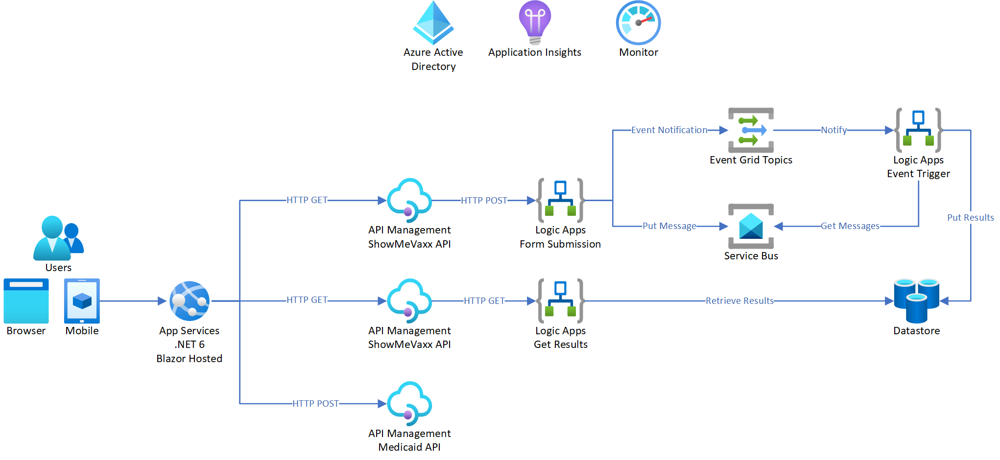

# Azure Integration Services Demo
 

# Prerequisites
- User with Contributor or Owner permissions for a resource group
- The following [resource providers](https://docs.microsoft.com/en-us/azure/azure-resource-manager/management/resource-providers-and-types)
  - Microsoft.ApiManagement
  - Microsoft.Insights
  - Microsoft.Logic
  - Microsoft.ServiceBus
  - Microsoft.Storage
  - Microsoft.Web

# Instructions
1. Click on the Deploy to Azure button above
2. Either create a new resource group or select an existing one
3. Enter a name for the application (to be used for resource naming purposes)
4. Leave the `[resourceGroup().location]` block as-is
5. Submit the template for deployment

# Diagram

# References
## API Management 

Learn how the API Management service functions, how to transform and secure APIs, and how to create a backend API. 
- [AZ-204: Implement API Management](https://docs.microsoft.com/en-us/learn/paths/az-204-implement-api-management/)
- [Reference architectures for Azure API Management](https://docs.microsoft.com/en-us/azure/architecture/reference-architectures/enterprise-integration/basic-enterprise-integration)
- [Azure API Management documentation](https://docs.microsoft.com/en-us/azure/api-management/)

## Service Bus

Learn how to build applications with message-based architectures by integrating Azure Service Bus and Azure Queue Storage in to your solution. 
- [AZ-204: Develop message-based solutions](https://docs.microsoft.com/en-us/learn/paths/az-204-develop-message-based-solutions/)
- [Reference architectures for Azure Service Bus](https://docs.microsoft.com/en-us/azure/architecture/reference-architectures/enterprise-integration/queues-events)
- [Azure Service Bus documentation](https://docs.microsoft.com/en-us/azure/service-bus-messaging/)

## App Services

Learn how Azure App Service functions and how to create and update an app. Explore App Service authentication and authorization, configuring app settings, scale apps, and how to use deployment slots. 
- [AZ-204: Create Azure App Service web apps](https://docs.microsoft.com/en-us/learn/paths/create-azure-app-service-web-apps/)
- [Reference architectures for Azure App Services](https://docs.microsoft.com/en-us/azure/architecture/guide/web/web-start-here)
- [Azure App Services documentation](https://docs.microsoft.com/en-us/azure/app-service/)
